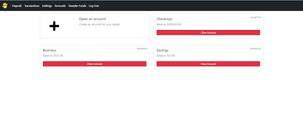
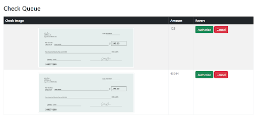

# OnlineATM

OnlineATM banking application written using Python, Django, MariaDB, OpenCV, EasyOCR, RabbitMQ, Celery

## Features
* User sign up, log in, password reset
* User OTP verification
* Open and close accounts


* Fund transfer between accounts
* OCR-based check deposit
* User settings adjustment
* Comprehensive transaction history
* Distinct admin and customer views
* Admin check and transaction verification


* Admin bank reports

## Running the project
### Setting up python project
1. Open terminal (use cd to navigate to same directory that you want project cloned in)
2. Clone the project:
```
$ git clone https://github.com/TheHS1/OnlineATM
$ cd onlineATM   
```
3. setup python virtual environment: ```$ python -m venv venv```
4. activate virtual environment: ```$ .\venv\Scripts\activate``` on windows or ```source ./venv/bin.activate``` on Linux
5. Install required packages: ```$ pip install -r requirements.txt```
6. Create the .env file with the following information: 
* SECRET_KEY - key used for encryption by Django, this can be any series of characters
* NAME - name of the mariadb database table
* UNAME - name of the mariadb user
* PASS - password of the mariadb user
* EMAIL - business email account for sending emails
* EMAIL_KEY - password used for the email account (or a passkey from the smtp service used)
* CELERY_BROKER_URL - message broker access URL for celery, see https://docs.celeryq.dev/en/stable/getting-started/backends-and-brokers/rabbitmq.html

### Setting up mysql (mariadb) 
1. Install the XAMPP software
2. Start the xampp server
3. Navigate to phpmyadmin (should be localhost/phpmyadmin)
4. Click new on the top left to create a new database
5. Name it OnlineATM and confirm
6. Click OnlineATM on the left column of databases
7. Click priveleges on the top bar (for this step you can create any user but edit .env to reflect that username and password)
8. Add user account with host name localhost and make sure Grant all privleges on database onlineATM is checked
 
### Finishing project setup
1. Go back to terminal and run the command: ```python manage.py runserver```
2. You should see something like starting developing server on 127.0.0.1:8000
3. Go to http://localhost:8000/ in browser
4. Hopefully the project loads up
5. Go back to terminal and do ctrl c to kill development server
6. Run ```python manage.py migrate``` to populate database
7. Restart the server, the project setup is complete
